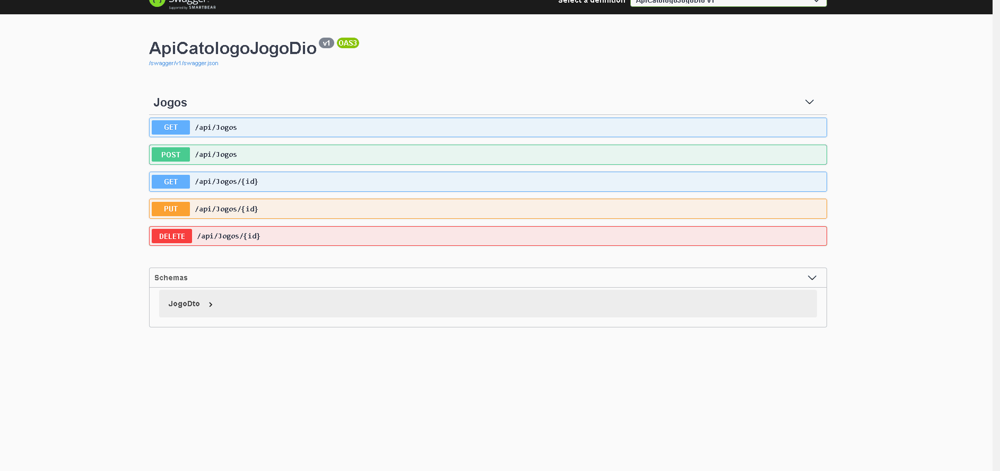
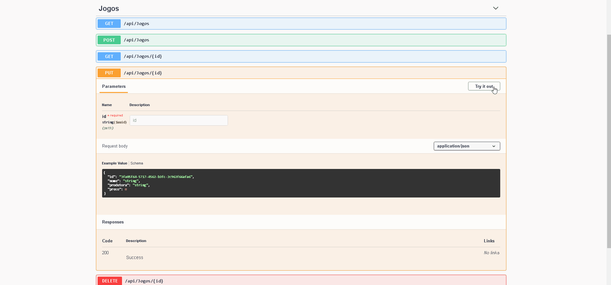
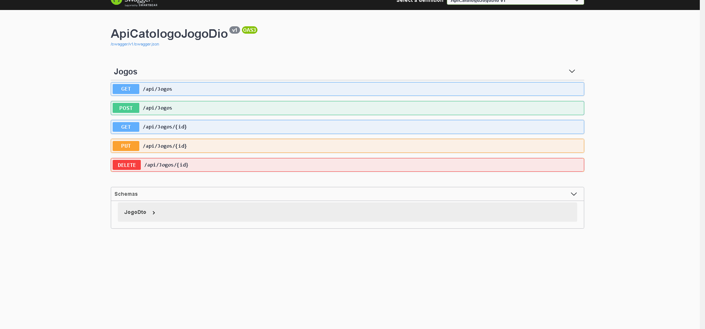

# ApiCatologoJogoDio
Portifolio da Dio alterado e melhorado por mim.

uma API Simples para cadastrar um jogo no Banco de Dados !!

Peguei o aprendizado que tive com o bootcamp da Avanade CodeAnywhere .NET na Digital Innovation One, no qual aprendo a criar uma api simples
a principio fiz a mesma coisa que a API do curso faz, mas adicionei o EntityFramework salvar os dados ! usei o AutoMapper para mapear as DTOs
e as Models, usando boas praticas 

e ainda irei melhora-la ainda mais criando mais Models para registrar também a Produtora que até então é uma propriedade da Model Jogo
e criar validações personalizadas e paginação para filtar melhor todos os jogos registrados !!

Segue imagens e Gifs da API ...

<h2>Requisição Get - Só registrei 2 no BD para ilustração</h2>

	

<h2>Requisição Post</h2>

	

<h2>Requisição Put</h2>
	

	

<h2>Requisição Delete</h2>
	

	

